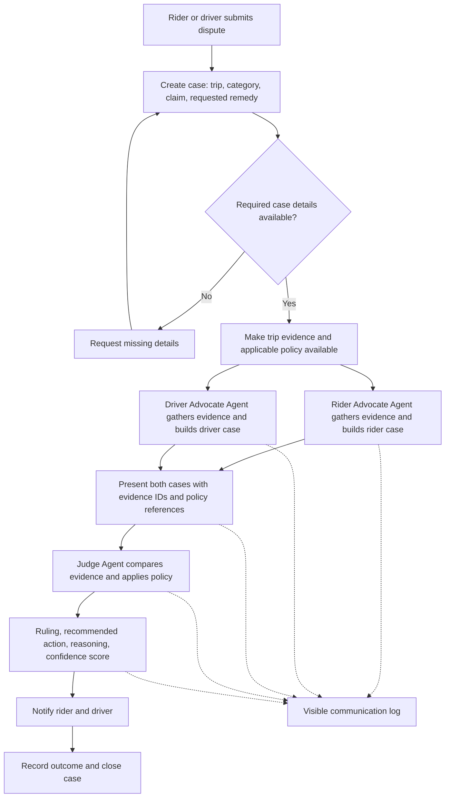
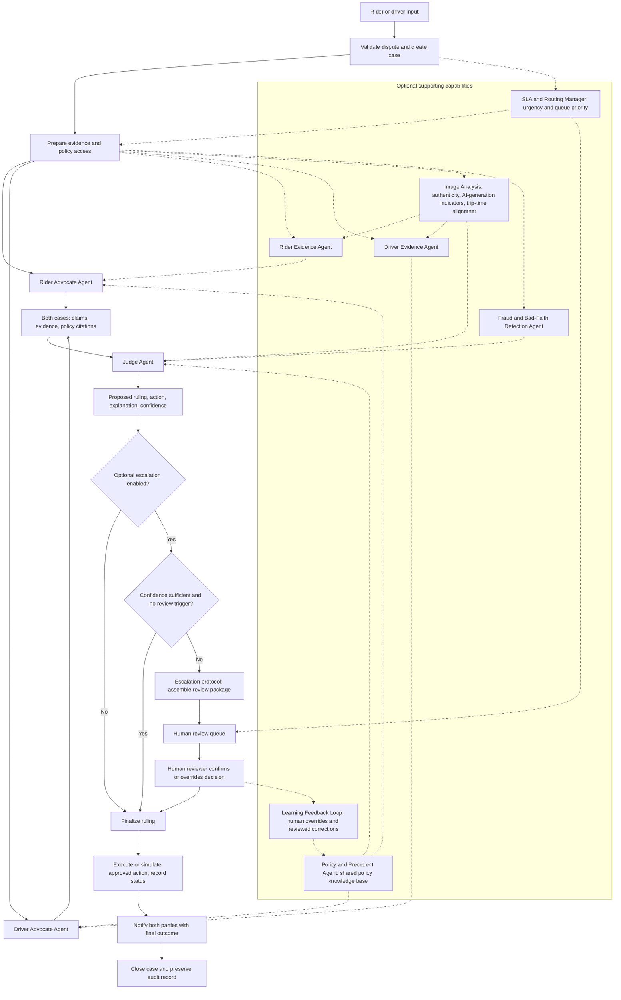

# Ryde Dispute Resolution Workflow

This proposed workflow translates the whiteboard into an end-to-end operating process aligned with the [project guidelines](README.md). It describes the intended system, rather than claiming these components are already implemented.

**Objective:** Resolve rider-driver disputes by gathering evidence, presenting both perspectives, applying company policy, and communicating a fair ruling with an explanation and confidence score.

## 1. Scope and Delivery Priorities

| Delivery level | Components |
| --- | --- |
| Required MVP | Rider Advocate Agent, Driver Advocate Agent, and Judge Agent; text and structured evidence; visible inter-agent communication; end-to-end resolution for at least two categories. |
| Proposed MVP categories | Route deviation and no-show charges. |
| Optional extensions from the whiteboard | Rider/driver evidence agents, policy agents, fraud detection, multimodal image analysis, SLA routing, and escalation. |
| Additional extension from the guidelines | Learning feedback loop from human-reviewed decisions. |

For the MVP, evidence retrieval and policy lookup can be tools used directly by the three core agents. Separate supporting agents are optional. External APIs and payment actions may be simulated for the demo.

## 2. Required MVP Workflow

### Operational Steps

| Step | Owner | Operation | Output |
| --- | --- | --- | --- |
| 1. Submit dispute | Rider or driver | Provide trip reference, dispute category, account identity, claim, and requested remedy. | A case ID linked to the trip. |
| 2. Validate intake | Application | Check required details and trip association; request missing information. | A case ready for investigation, or awaiting information. |
| 3. Gather evidence | Both advocate agents using evidence tools | Retrieve relevant GPS, timestamps, chat, fare records, and history. Label unavailable or conflicting evidence explicitly. | Traceable evidence records with source references. |
| 4. Retrieve policy | Both advocate agents using policy tools | Identify applicable policy clauses from the same policy version. | Policy references shared with the Judge Agent. |
| 5. Build cases | Rider and Driver Advocate Agents | Independently explain each party's position, relevant facts, counter-evidence, and requested outcome. | Two structured case submissions. |
| 6. Review and rule | Judge Agent | Compare both cases against underlying evidence and policy. Explain accepted and rejected arguments. | Ruling, action, reasoning summary, and confidence score. |
| 7. Communicate outcome | Application | Deliver the same decision to both parties, with wording relevant to each party. | Rider and driver notifications. |
| 8. Complete case | Application | Record the recommended action and its execution status, if execution is implemented. Preserve the case and communication log. | An auditable completed case. |

The visible log should show evidence requests and responses, case submissions, policy references, and the Judge Agent's decision summary. It should expose how agents exchange information without requiring private model reasoning.

## 3. Full Workflow With Optional Extensions

Dashed connections and the optional subgraph represent stretch capabilities. The core flow remains usable when these capabilities are disabled.

### How the Whiteboard Components Fit Together

| Component | Operation | Recipient |
| --- | --- | --- |
| Rider Evidence Agent | Collects and organizes evidence relevant to the rider's claim. | Rider Advocate Agent. |
| Driver Evidence Agent | Collects and organizes evidence relevant to the driver's defence or claim. | Driver Advocate Agent. |
| Policy support | Retrieves relevant clauses and precedent for each side, using one shared policy source and version. | Both advocates and the Judge Agent. |
| Image Analysis | Examines submitted photos for authenticity indicators, possible AI generation, and alignment with trip timestamps. Reports uncertainty. | Evidence agents and Judge Agent. |
| Fraud and Bad-Faith Detection Agent | Checks for repeated claims, contradictions with GPS, unusual dispute patterns, and possible account collusion. | Judge Agent receives risk signals and supporting evidence. |
| SLA and Routing Manager | Sets priority at intake and manages review-queue urgency, including safety incidents. | Application and human review queue. |
| Escalation protocol | Packages both cases, evidence, policy references, proposed ruling, and reason for review. | Human reviewer. |
| Learning Feedback Loop | Captures reviewed corrections and human overrides for controlled knowledge-base updates. | Policy and Precedent Agent. |

**Design clarification:** The whiteboard shows policy agents for each side and both sides. These can be implemented as different retrieval roles over one shared policy knowledge base, ensuring consistent policy application. SLA routing begins at intake and continues through escalation and delivery, expanding its placement after the ruling in the sketch.

Fraud indicators and account history provide context; they should not independently determine fault. Both advocates should be able to address material evidence used by the Judge Agent. Image-authenticity findings are signals with uncertainty, rather than proof on their own.

## 4. Evidence Flow

| Evidence source | Analysis | Example use |
| --- | --- | --- |
| GPS and telemetry | Actual versus optimal route distance, unexpected stops, estimated versus actual duration, and pickup location. | Assess a route-deviation claim or whether the driver reached the pickup point. |
| Chat and communication logs | Agreements, route requests, arrival messages, disagreements, sentiment, and threats. | Determine whether a detour was requested or whether arrival was communicated. |
| Payment and fare data | Fare breakdown, cancellation fees, surge pricing, and promo usage. | Confirm the disputed amount and calculate a policy-supported remedy. |
| Historical behaviour profiles | Prior disputes, ratings, account age, and repeated patterns. | Add context or identify optional fraud-review signals. |
| Photos, optional | Damage or mess, authenticity indicators, and trip-timestamp alignment. | Assess a property-damage or cleaning-fee claim. |

Each evidence item should carry an ID, source, trip association, available timestamp, and retrieval status. Missing evidence must remain marked as missing; agents must not substitute assumptions for records.

## 5. Judge Decision and Outcome Handling

The Judge Agent produces:

- **Decision:** uphold, partially uphold, or reject the claim, with a plain-language ruling.
- **Recommended action:** refund, compensation, fee reversal, or no action, as supported by policy.
- **Amount:** when applicable, with the calculation and currency.
- **Evidence and policy references:** the records and clauses supporting the ruling.
- **Reasoning summary:** why the decision follows from the evidence and how competing claims were assessed.
- **Confidence score:** a defined score reflecting evidence completeness, consistency, and policy fit.

The confidence scale and any escalation threshold are implementation choices to be configured and validated; the guidelines do not prescribe a numeric threshold.

With optional escalation enabled, low confidence or a configured review trigger sends the proposed decision to a human reviewer before finalization. The system tells both parties that review is pending. A human override is recorded with a reason and can feed the optional learning loop.

For the hackathon, financial actions can be mocked. The interface should distinguish a recommended refund from one that has actually been executed. If an action fails, retain its pending or failed status and resolve the failure before marking the case complete.

## 6. Demo Walkthroughs

### A. Route Deviation

1. The rider submits: "The driver took a longer route and I was overcharged."
2. Both advocates retrieve the GPS trace, expected route, trip duration, fare breakdown, and chat history.
3. The Rider Advocate identifies excess distance or charges and cites the relevant policy.
4. The Driver Advocate checks for rider-requested detours, recorded route constraints, and other evidence supporting the route taken.
5. The Judge compares both submissions against the records and policy.
6. Both parties receive the ruling, explanation, and confidence score. A partial refund of $3.25 is an illustrative outcome from the guidelines, not a fixed rule.

### B. No-Show Charge

1. The rider submits: "The driver did not show up, but I was charged a cancellation fee."
2. Both advocates retrieve pickup GPS, arrival and cancellation timestamps, available waiting-time records, chat messages, and the charged fee.
3. The Rider Advocate checks whether the driver reached the agreed pickup location and communicated arrival.
4. The Driver Advocate checks whether the driver arrived, waited as required by the supplied policy, and attempted contact.
5. The Judge applies the supplied cancellation policy and determines whether the fee should stand or be reversed.
6. Both parties receive the outcome and explanation; any reversal is executed or simulated and recorded.

Policy rules, waiting periods, and compensation formulas must come from provided or explicitly labelled mock policies. They are not defined by the challenge brief.

## 7. Demo Day Completion Checklist

- [ ] Identify the Ryde dispute-resolution case study at the start of the presentation.
- [ ] Demonstrate the three required agents working end to end.
- [ ] Resolve both route-deviation and no-show cases using text and structured evidence.
- [ ] Show a visible log of agent communication, evidence references, and case submissions.
- [ ] Display the final ruling, recommended action, reasoning summary, and confidence score.
- [ ] Communicate the outcome to both rider and driver views.
- [ ] Clearly label simulated data, policies, APIs, and financial actions.
- [ ] Use the diagrams above to explain the architecture and operating flow.
- [ ] Provide a working prototype, live walkthrough, and complete source code in GitHub.
- [ ] Add stretch capabilities after the MVP is functional.

## Sources

- [Project guidelines](README.md): required agents, evidence sources, deliverables, and optional enhancements.
- [Whiteboard](Untitled%20Whiteboard%20%282%29.pdf): rider/driver evidence and policy support, image analysis, fraud detection, judging, routing, escalation, and outcome communication.
