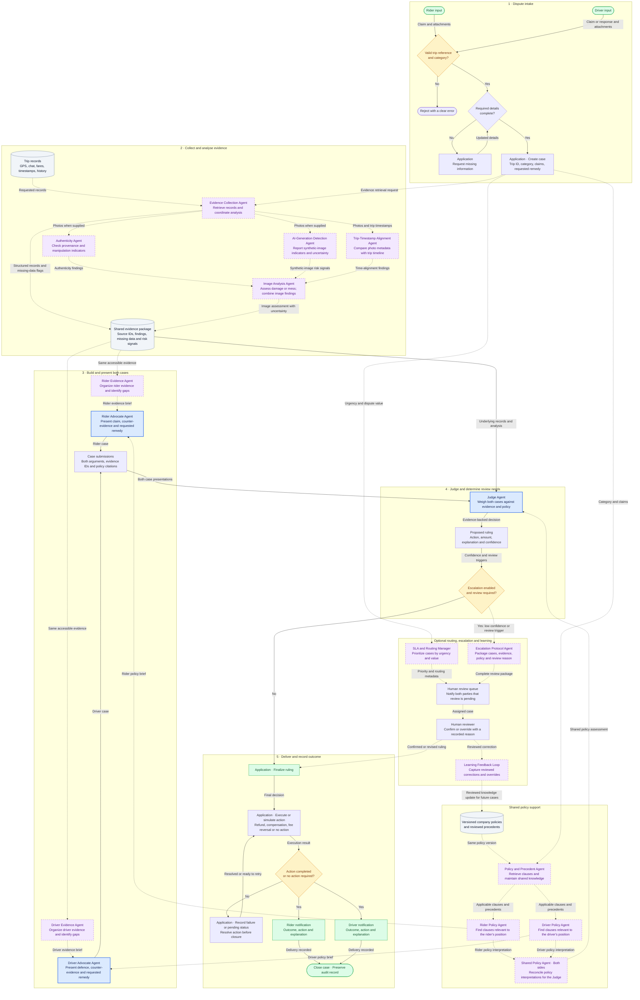
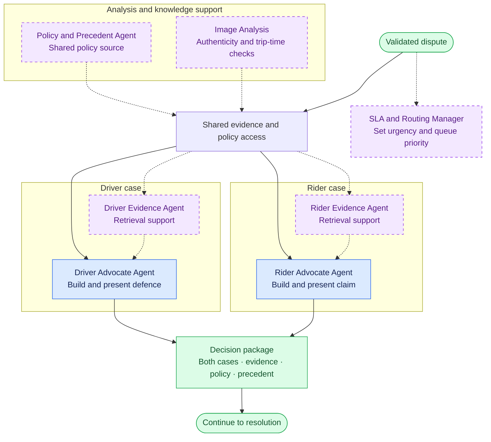
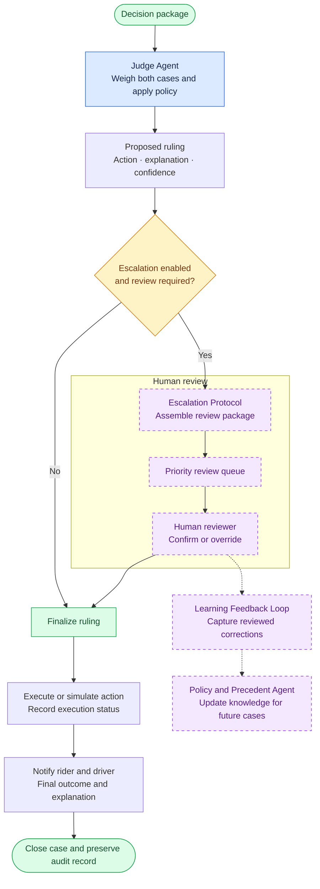

# Ryde Dispute Resolution Workflow

This proposed workflow translates the whiteboard into an end-to-end operating process aligned with the [project guidelines](README.md). It describes the intended system, rather than claiming these components are already implemented.

**Objective:** Resolve rider-driver disputes by gathering evidence, presenting both perspectives, applying company policy, and communicating a fair ruling with an explanation and confidence score.

## 1. Scope and Delivery Priorities

We are building every component below except the Fraud and Bad-Faith Detection Agent, which the team has dropped. Delivery is tiered: each tier must work end to end before the next starts, and if time runs out we stop at a tier boundary.

| Tier | Components |
| --- | --- |
| 0, required MVP | Rider Advocate Agent, Driver Advocate Agent, and Judge Agent; text and structured evidence; visible inter-agent communication; end-to-end resolution for route deviation and no-show charges. |
| 1 | Escalation protocol, Policy and Precedent Agent, Rider and Driver Evidence Agents. |
| 2 | SLA and Routing Manager; safety incident category. |
| 3 | Multimodal image analysis with authenticity checks; property damage category. |
| 4 | Learning feedback loop from human-reviewed decisions. |
| Not building | Fraud and Bad-Faith Detection Agent. |

In Tier 0, evidence retrieval and policy lookup are tools used directly by the three core agents; the supporting agents wrap those tools from Tier 1. Every supporting agent sits behind a switch, so the core flow works with all of them off. External APIs and payment actions are simulated for the demo. Agent design is in [docs/architecture.md](docs/architecture.md); dates and ownership are in [docs/dev-guide.md](docs/dev-guide.md).

## 2. Complete Operational Workflow

Follow the flow from top to bottom. Each agent box states its role, and each arrow names the information passed to the next component. Blue boxes identify the three required agents; purple boxes and dashed arrows identify optional agent capabilities and their exchanges. Grey cylinders hold data, yellow diamonds show decisions, and green boxes mark inputs and outcomes. The human reviewer and application steps are explicitly labelled.

**MVP path:** When supporting agents are disabled, the Rider Advocate and Driver Advocate retrieve evidence and policy directly using tools, then submit their cases to the Judge. This graph shows the complete expanded design with all supporting agents enabled. Image checks run only when photos are supplied; absent photos do not block text-only disputes.

**Throughout the process:** a visible communication log records evidence requests, agent exchanges, policy references, case submissions, and decision summaries.

### Operational Steps

| Step | Owner | Operation | Output |
| --- | --- | --- | --- |
| 1. Submit dispute | Rider or driver | Provide trip reference, dispute category, account identity, claim, and requested remedy. | A case ID linked to the trip. |
| 2. Validate intake | Application | Check the trip reference and dispute category. Invalid input is rejected with a clear error; there is no interactive request for missing details. | A case ready for investigation, or a rejection. |
| 3. Gather evidence | Both advocate agents using evidence tools | Retrieve relevant GPS, timestamps, chat, fare records, and history. Label unavailable or conflicting evidence explicitly. | Traceable evidence records with source references. |
| 4. Retrieve policy | Both advocate agents using policy tools | Identify applicable policy clauses from the same policy version. | Policy references shared with the Judge Agent. |
| 5. Build cases | Rider and Driver Advocate Agents | Independently explain each party's position, relevant facts, counter-evidence, and requested outcome. | Two structured case submissions. |
| 6. Review and rule | Judge Agent | Compare both cases against underlying evidence and policy. Explain accepted and rejected arguments. | Ruling, action, reasoning summary, and confidence score. |
| 7. Communicate outcome | Application | Deliver the same decision to both parties, with wording relevant to each party. | Rider and driver notifications. |
| 8. Complete case | Application | Record the recommended action and its execution status, if execution is implemented. Preserve the case and communication log. | An auditable completed case. |

The visible log should show evidence requests and responses, case submissions, policy references, and the Judge Agent's decision summary. It should expose how agents exchange information without requiring private model reasoning.

## 3. Full Workflow With Supporting Agents

The expanded workflow is split into two connected diagrams for readability. Purple boxes and dashed arrows identify supporting agents, each behind a switch (Tiers 1 to 4). **Decision package** connects investigation to resolution. The core flow remains usable when every supporting agent is switched off.

### A. Investigation and Case Building

Supporting analysis uses the case's available evidence. Its findings return to the shared evidence access point so both advocates and the Judge can inspect the same material. Evidence is sealed before cases are built, so everyone argues from the same set of facts. SLA priority follows the case into the review queue.

### B. Ruling, Escalation, and Closure

Review is required when confidence falls below the configured threshold or another configured review trigger applies. Pending reviews are communicated to both parties. Action failures remain pending or failed until resolved; closure follows successful completion or a recorded no-action outcome.

### How the Whiteboard Components Fit Together

| Component | Operation | Recipient |
| --- | --- | --- |
| Rider Evidence Agent | Collects and organizes evidence relevant to the rider's claim. | Rider Advocate Agent. |
| Driver Evidence Agent | Collects and organizes evidence relevant to the driver's defence or claim. | Driver Advocate Agent. |
| Policy support | Retrieves relevant clauses and precedent for each side, using one shared policy source and version. | Both advocates and the Judge Agent. |
| Image Analysis | Examines submitted photos for authenticity indicators, possible AI generation, and alignment with trip timestamps. Reports uncertainty. | Evidence agents and Judge Agent. |
| Evidence Collection Agent | Retrieves source records and coordinates optional image analysis. | Shared evidence package and specialist analysis agents. |
| Policy and Precedent Agent | Retrieves versioned clauses and reviewed precedents from shared knowledge. | Rider and Driver Policy Agents. |
| Rider Policy Agent | Identifies applicable clauses supporting or limiting the rider's position. | Rider Advocate and Shared Policy Agent. |
| Driver Policy Agent | Identifies applicable clauses supporting or limiting the driver's position. | Driver Advocate and Shared Policy Agent. |
| Shared Policy Agent | Reconciles both policy interpretations against the same source version. | Judge Agent. |
| Authenticity Agent | Checks available provenance and manipulation indicators. | Image Analysis Agent. |
| AI-Generation Detection Agent | Reports possible synthetic-image indicators and uncertainty. | Image Analysis Agent. |
| Trip-Timestamp Alignment Agent | Compares available photo metadata with the trip timeline and flags missing metadata. | Image Analysis Agent. |
| Image Analysis Agent | Combines specialist findings and assesses visible damage or mess. | Shared evidence package, used by both evidence agents and the Judge. |
| SLA and Routing Manager | Sets priority at intake and manages review-queue urgency, including safety incidents. | Application and human review queue. |
| Escalation protocol | Packages both cases, evidence, policy references, proposed ruling, and reason for review. | Human reviewer. |
| Learning Feedback Loop | Captures reviewed corrections and human overrides for controlled knowledge-base updates. | Policy and Precedent Agent. |

**Design clarification:** The whiteboard shows policy agents for each side and both sides. The expanded graph shows these as separate Rider Policy, Driver Policy, and Shared Policy Agents, supported by a Policy and Precedent Agent over one versioned knowledge base. The evidence coordinator and specialist agents are a proposed decomposition of the optional capabilities; the challenge requires only the three core agents. SLA routing begins at intake and continues through escalation and delivery, expanding its placement after the ruling in the sketch.

The whiteboard also shows a Fraud and Bad-Faith Detection Agent; the team is not building it. Account history provides context only; it must not independently determine fault. Both advocates should be able to address material evidence used by the Judge Agent. Image-authenticity findings are signals with uncertainty, rather than proof on their own.

## 4. Evidence Flow

| Evidence source | Analysis | Example use |
| --- | --- | --- |
| GPS and telemetry | Actual versus optimal route distance, unexpected stops, estimated versus actual duration, and pickup location. | Assess a route-deviation claim or whether the driver reached the pickup point. |
| Chat and communication logs | Agreements, route requests, arrival messages, disagreements, sentiment, and threats. | Determine whether a detour was requested or whether arrival was communicated. |
| Payment and fare data | Fare breakdown, cancellation fees, surge pricing, and promo usage. | Confirm the disputed amount and calculate a policy-supported remedy. |
| Historical behaviour profiles | Prior disputes, ratings, account age, and repeated patterns. | Add context for the Judge. Never the sole grounds for a ruling. |
| Photos (Tier 3) | Damage or mess, authenticity indicators, and trip-timestamp alignment. | Assess a property-damage or cleaning-fee claim. |

Each evidence item should carry an ID, source, trip association, available timestamp, and retrieval status. Missing evidence must remain marked as missing; agents must not substitute assumptions for records.

## 5. Judge Decision and Outcome Handling

The Judge Agent produces:

- **Decision:** uphold, partially uphold, or reject the claim, with a plain-language ruling.
- **Recommended action:** refund, compensation, fee reversal, or no action, as supported by policy.
- **Amount:** when applicable, with the calculation and currency.
- **Evidence and policy references:** the records and clauses supporting the ruling.
- **Reasoning summary:** why the decision follows from the evidence and how competing claims were assessed.
- **Confidence score:** a defined score reflecting evidence completeness, consistency, and policy fit.

The Judge explicitly accepts or rejects each side's material arguments with a reason; the advocates do not rebut each other in a separate round. The confidence scale and escalation threshold are implementation choices; the proposal (a 0 to 1 score with a default threshold of 0.7) is in [docs/architecture.md](docs/architecture.md) and is confirmed in the contract session. The guidelines do not prescribe a numeric threshold.

With escalation switched on, low confidence or a configured review trigger (for example a safety incident, or a photo that fails authenticity checks) sends the proposed decision to a human reviewer before finalization. The system tells both parties that review is pending. A human override is recorded with a reason and feeds the learning loop as new precedent.

For the hackathon, financial actions can be mocked. The interface should distinguish a recommended refund from one that has actually been executed. If an action fails, retain its pending or failed status and resolve the failure before marking the case complete.

## 6. Demo Walkthroughs

### A. Route Deviation

1. The rider submits: "The driver took a longer route and I was overcharged."
2. Both advocates retrieve the GPS trace, expected route, trip duration, fare breakdown, and chat history.
3. The Rider Advocate identifies excess distance or charges and cites the relevant policy.
4. The Driver Advocate checks for rider-requested detours, recorded route constraints, and other evidence supporting the route taken.
5. The Judge compares both submissions against the records and policy.
6. Both parties receive the ruling, explanation, and confidence score. A partial refund of $3.25 is an illustrative outcome from the guidelines, not a fixed rule.

### B. No-Show Charge

1. The rider submits: "The driver did not show up, but I was charged a cancellation fee."
2. Both advocates retrieve pickup GPS, arrival and cancellation timestamps, available waiting-time records, chat messages, and the charged fee.
3. The Rider Advocate checks whether the driver reached the agreed pickup location and communicated arrival.
4. The Driver Advocate checks whether the driver arrived, waited as required by the supplied policy, and attempted contact.
5. The Judge applies the supplied cancellation policy and determines whether the fee should stand or be reversed.
6. Both parties receive the outcome and explanation; any reversal is executed or simulated and recorded.

### C. Safety Incident (Tier 2)

1. The rider submits: "The driver behaved inappropriately during the trip."
2. The SLA and Routing Manager gives the case top priority.
3. Both advocates build their cases from chat, trip records, and any statement.
4. The Judge issues a proposed ruling. Because the category is a safety incident, it is always escalated.
5. The human reviewer sees the case at the front of the review queue with the full review package, and confirms or overrides.

### D. Property Damage (Tier 3)

1. The driver submits a cleaning-fee claim with photos: "The rider spilled drinks in the car."
2. Image Analysis reports what each photo shows, whether its timestamp aligns with the trip, and any sign of AI generation, each with stated uncertainty.
3. Both advocates build their cases; the rider is now the respondent.
4. The Judge weighs the photo findings as signals. A photo that fails authenticity checks lowers confidence and triggers review; it never decides the case alone.
5. Both parties receive the outcome, or are told that review is pending.

Policy rules, waiting periods, and compensation formulas must come from provided or explicitly labelled mock policies. They are not defined by the challenge brief.

## 7. To-Do and Demo Day Checklist

Work top to bottom. Do not start a tier until the one above it is fully ticked. Owners and dates are in [docs/dev-guide.md](docs/dev-guide.md).

### Before building

- [ ] Log in to the GitHub CLI and publish the spec and tickets as issues.
- [ ] Hold the contract session: fix the contract objects, confidence model, escalation triggers, and switches.
- [ ] Confirm the model provider, including a model that accepts images for Tier 3.
- [ ] Write the mock policy with clause IDs, resolving the free-wait versus no-show threshold ambiguity.

### Tier 0: required MVP (target Sat 10 Oct)

- [ ] Model adapter with an offline stub.
- [ ] Evidence tools: GPS and route comparison, chat, fare, history.
- [ ] Mock cases for route deviation and no-show: claimant wins, respondent wins, and one ambiguous, each with a separate evaluation label.
- [ ] Rider Advocate and Driver Advocate produce independent submissions.
- [ ] Judge issues a ruling with per-argument assessment, cited evidence and clauses, amount, and confidence.
- [ ] Orchestrator runs a dispute end to end and writes the communication log.
- [ ] Web UI: dispute selector, live log, ruling card, rider and driver outcome views.
- [ ] Simulated data, policies, and financial actions are labelled on screen.

### Tier 1 (target Sun 11 Oct)

- [ ] Escalation protocol: triggers, review package, review queue, reviewer screen, "review pending" outcome.
- [ ] Policy and Precedent Agent with a seeded store of past rulings.
- [ ] Rider and Driver Evidence Agents wrapping the evidence tools.
- [ ] Judge stability check with submission order swapped.

### Tier 2 (target Mon 12 Oct)

- [ ] SLA and Routing Manager sets priority and orders the review queue.
- [ ] Safety incident mock cases; safety incidents always escalate.

### Tier 3 (target Tue 13 Oct)

- [ ] Image Analysis: photo description, trip-timestamp alignment, AI-generation signal, each with uncertainty.
- [ ] Property damage mock cases with photos, including one that fails authenticity checks.
- [ ] Photo upload and photo findings in the UI.

### Tier 4 (only if ahead of schedule)

- [ ] Learning feedback loop: a human override becomes precedent that a later similar case sees.

### Demo Day

- [ ] Identify the Ryde dispute-resolution case study at the start of the presentation.
- [ ] Demonstrate the three required agents working end to end, with supporting agents switched off and then on.
- [ ] Resolve both route-deviation and no-show cases using text and structured evidence.
- [ ] Show one case ruled for the claimant and one for the respondent.
- [ ] Show a visible log of agent communication, evidence references, and case submissions.
- [ ] Display the final ruling, recommended action, reasoning summary, and confidence score.
- [ ] Communicate the outcome to both rider and driver views.
- [ ] Clearly label simulated data, policies, APIs, and financial actions.
- [ ] Use the diagrams to explain the architecture and operating flow.
- [ ] Rehearse the walkthrough end to end twice.
- [ ] Provide a working prototype, live walkthrough, and complete source code in GitHub.

## Sources

- [Project guidelines](README.md): required agents, evidence sources, deliverables, and optional enhancements.
- [Whiteboard](Untitled%20Whiteboard%20%282%29.pdf): rider/driver evidence and policy support, image analysis, fraud detection (not being built), judging, routing, escalation, and outcome communication.
- [Spec](docs/spec.md), [architecture](docs/architecture.md), [dev guide](docs/dev-guide.md), and [glossary](GLOSSARY.md): behaviour, agent design, ownership and dates, and vocabulary.
